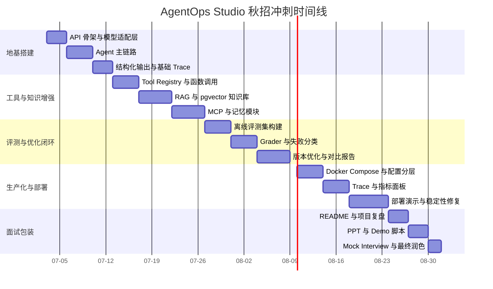

# 秋招前 Agent 工程师项目可行性分析与实施报告

更新时间：2026-07-03  
目标窗口：2026-08-31 前形成可投递、可演示、可复盘的项目作品集

## 1. 结论先行

本项目可行，但必须严格收缩范围。

建议把项目定位为 **AgentOps Studio：面向研发与知识工作流的可评测 Agent 工程平台**。它不应只是一个聊天 Demo，而应展示从任务规划、工具调用、RAG、记忆、可观测、评测到部署的完整工程闭环。

截至 2026-07-03，距离 2026-08-31 约 59 天。这个时间足够完成一个有说服力的单 Agent 工程系统，但不足以同时做深度多 Agent、自训练大模型、完整 GUI 自动化、复杂 RLHF 和精装修商业级前端。因此，项目策略应是：

**先做深单 Agent 主链路，再补工具、评测、部署和演示材料；多 Agent、轻量偏好优化、自托管模型只作为加分项。**

推荐优先级如下：

1. P0：单 Agent 主链路，稳定完成 `plan -> act -> reflect -> finalize`。
2. P0：工具调用、RAG、短期记忆、长期记忆、结构化输出。
3. P0：评测集、Trace、失败分类、版本对比报告。
4. P0：Docker Compose 本地一键启动，README 和 Demo 脚本完整。
5. P1：MCP 接入、在线演示环境、监控面板、成本和延迟统计。
6. P2：多 Agent 展示、轻量 DPO/IL 实验、自托管模型服务。

最终要交付的不是“我学过 Agent”，而是一套能让面试官快速判断你具备 Agent 工程能力的证据包：代码仓库、可运行 Demo、评测报告、Trace 面板、README、PPT、演示脚本和面试问答稿。

## 2. 项目定位

### 2.1 不建议做什么

不建议做一个“万能 AI 助手”。这类项目边界模糊，容易陷入功能堆砌，面试时也难证明工程深度。

也不建议一开始就做复杂多 Agent。多 Agent 很容易增加调试复杂度，但未必提升面试说服力。对秋招作品集来说，一个稳定、可解释、可评测的单 Agent 系统，比一个不稳定的多 Agent 编排更有价值。

### 2.2 建议做什么

建议做一个面向研发和知识工作流的 Agent 平台，核心任务包括：

- 读取 PRD、RFC、项目文档或知识库内容。
- 检索文档、代码仓库和结构化数据。
- 规划子任务并选择合适工具。
- 调用搜索、SQL、Python、MCP 等工具。
- 基于证据生成结构化报告。
- 记录完整执行 Trace。
- 对结果进行离线和在线评测。

这个场景天然覆盖 Agent 工程岗位高频能力：Planning、Tool Use、RAG、Memory、Eval、Observability、Deployment、Cost/Latency Control。

### 2.3 项目名称与一句话介绍

项目名称：**AgentOps Studio**

一句话介绍：  
AgentOps Studio 是一个面向研发与知识工作流的可评测 Agent 平台，支持任务规划、工具调用、知识检索、记忆管理、执行追踪、离线评测和容器化部署。

## 3. 可行性判断

### 3.1 时间可行性

如果目标是 2026-08-31 前投递，时间非常紧，但仍可完成一个工程闭环。

可行的原因：

- FastAPI、LangGraph、PostgreSQL、pgvector、Docker Compose 等基础设施成熟。
- 主链路可以先用 hosted LLM API 实现，不必从模型训练开始。
- RAG、工具调用、结构化输出、Trace 和 Eval 都能通过工程方式快速落地。
- 项目展示重点在系统设计和工程闭环，不在模型本身的 SOTA 能力。

不可行的部分：

- 不适合做大规模 RLHF 或自研基础模型。
- 不适合做完整商业产品级前端。
- 不适合同时覆盖 coding agent、research agent、data agent、browser agent、GUI agent 全部方向。
- 不适合一开始追求复杂多 Agent 协作。

结论：  
**做一个单 Agent 工程平台是可行的；做一个大而全的 Agent 产品不可行。**

### 3.2 技术可行性

推荐技术栈成熟度较高，适合短周期实现：

| 模块 | 推荐方案 | 可行性判断 |
|---|---|---|
| 后端 API | FastAPI | 高。适合异步 API、流式输出、Pydantic schema |
| Agent 编排 | LangGraph | 高。适合状态机、持久化、重试和中断恢复 |
| 模型接入 | OpenAI-compatible Adapter | 高。便于切换 OpenAI、DeepSeek、Qwen、本地模型 |
| 结构化输出 | Pydantic / JSON Schema | 高。便于前端展示和评测 |
| RAG | PostgreSQL + pgvector | 高。一个数据库同时承载业务数据、向量和元数据 |
| 记忆 | Checkpointer + DB Store | 中高。短期状态和长期记忆需要明确边界 |
| 工具调用 | Function Calling + Tool Registry | 高。能快速做出稳定工具层 |
| MCP | MCP client/server | 中。适合作为 P1 加分项，不应阻塞主链路 |
| 评测 | pytest + 自建任务集 + LLM-as-judge | 高。小规模即可形成说服力 |
| 可观测 | OpenTelemetry / MLflow / LangSmith 可选 | 中高。至少要有 Trace 和指标记录 |
| 部署 | Docker Compose | 高。秋招展示优先保证本地一键启动 |

### 3.3 面试价值可行性

这个项目的面试价值较高，因为它能自然引出以下问题：

- 为什么选择 LangGraph，而不是手写 while loop？
- 如何防止工具调用陷入死循环？
- RAG 检索质量差时如何定位？
- 如何设计短期记忆和长期记忆？
- 如何做 Agent 的离线评测和在线评测？
- 如何控制 token 成本、延迟和失败率？
- 如何把 Trace 转化为回归测试数据？
- 如何判断一次优化是真的有效，而不是主观感觉更好？

这些问题比“我接了某个模型 API”更能体现工程能力。

## 4. 能力矩阵

| 能力 | 优先级 | 项目中如何体现 | 面试价值 |
|---|---|---|---|
| 模型接入 | P0 | 统一 provider adapter，支持至少 2 个模型后端 | 证明不是绑定单一厂商 SDK |
| 任务规划 | P0 | 输出结构化 plan，包含步骤、工具、依赖和终止条件 | 体现 Agent 核心控制能力 |
| 工具调用 | P0 | Search、SQL、Python、文档检索等工具统一注册 | 体现真实任务执行能力 |
| 结构化输出 | P0 | 最终结果符合 schema，可被前端和评测模块消费 | 避免散文式 Demo |
| RAG | P0 | 文档切分、向量检索、元数据过滤、引用展示 | 体现知识接入能力 |
| 短期记忆 | P0 | 单次任务中的 state、steps、tool results、trace | 支撑多步任务执行 |
| 长期记忆 | P1 | 用户偏好、项目背景、历史任务摘要 | 体现跨任务学习能力 |
| Trace | P0 | 每一步记录输入、输出、耗时、成本、错误 | 便于调试和展示 |
| Eval | P0 | 30-50 条任务集，指标化比较版本效果 | 证明优化有效 |
| 部署 | P0 | Docker Compose 一键启动 | 便于面试官复现 |
| MCP | P1 | 接入 1-2 个 MCP 工具 | 体现新协议理解 |
| 多 Agent | P2 | supervisor-worker 小演示 | 加分，但不作为主线 |
| 轻量优化 | P2 | prompt ablation、路由策略、少量偏好样本 | 加分，不做重训练 |

## 5. 推荐架构

### 5.1 总体架构

```text
Web UI / CLI
    |
FastAPI API Layer
    |
Agent Runtime
    |-- Planner
    |-- Tool Router
    |-- Executor
    |-- Reflector
    |-- Finalizer
    |
Tool Layer
    |-- Search Tool
    |-- SQL Tool
    |-- Python Tool
    |-- RAG Retriever
    |-- MCP Bridge
    |
Memory & Storage
    |-- PostgreSQL
    |-- pgvector
    |-- Redis optional
    |
Observability & Eval
    |-- Trace Store
    |-- Eval Dataset
    |-- Metrics
    |-- Reports
```

### 5.2 核心执行链路

建议所有功能都围绕同一条主链路迭代：

```text
用户任务
  -> 任务理解
  -> 生成计划
  -> 选择工具
  -> 调用工具
  -> 记录 Trace
  -> 反思与重规划
  -> 生成结构化结果
  -> 运行评测
```

这条链路是项目的生命线。任何新增功能都应服务于它，而不是另起炉灶。

### 5.3 建议目录结构

```text
agentops-studio/
  app/
    api/
      routes.py
      schemas.py
    agent_core/
      graph.py
      state.py
      planner.py
      executor.py
      reflector.py
      finalizer.py
      policies.py
    providers/
      base.py
      openai_compatible.py
      deepseek.py
      qwen.py
    tools/
      registry.py
      search.py
      sql.py
      python_runner.py
      mcp_bridge.py
    knowledge/
      ingest.py
      chunker.py
      retriever.py
      reranker.py
    memory/
      short_term.py
      long_term.py
    observability/
      tracing.py
      metrics.py
      cost.py
    evals/
      datasets/
      graders.py
      runner.py
      report.py
    storage/
      db.py
      models.py
  tests/
  docker-compose.yml
  README.md
  .env.example
```

文件职责说明：

| 路径 | 职责 |
|---|---|
| `app/` | 后端主应用目录，承载 API、Agent Runtime、工具、知识库、记忆、评测和存储逻辑。 |
| `app/api/` | 对外 HTTP API 层，只负责请求接入、参数校验、响应返回，不承载复杂业务逻辑。 |
| `app/api/routes.py` | 定义 FastAPI 路由，例如创建任务、查询任务状态、获取 Trace、触发评测等接口。 |
| `app/api/schemas.py` | 定义 API 请求和响应的 Pydantic schema，例如任务输入、任务结果、错误响应、分页结果。 |
| `app/agent_core/` | Agent 核心运行时，负责规划、执行、反思、终止、预算控制和状态流转。 |
| `app/agent_core/graph.py` | 定义 Agent 状态图或 LangGraph 编排逻辑，把 planner、executor、reflector、finalizer 串成主链路。 |
| `app/agent_core/state.py` | 定义 Agent 运行状态，例如用户任务、计划、已执行步骤、工具结果、错误、token 成本、最终答案。 |
| `app/agent_core/planner.py` | 负责把用户任务拆成结构化计划，决定需要哪些步骤、工具和证据。 |
| `app/agent_core/executor.py` | 执行计划中的具体步骤，调用工具层或模型层，并把结果写回 state。 |
| `app/agent_core/reflector.py` | 对中间结果做检查和反思，判断是否需要重试、补充检索、重规划或提前终止。 |
| `app/agent_core/finalizer.py` | 汇总证据、工具结果和推理过程，生成符合 schema 的最终输出。 |
| `app/agent_core/policies.py` | 放置运行策略，例如最大步骤数、工具调用预算、模型路由、失败重试、人工审批规则。 |
| `app/providers/` | 模型提供商适配层，隔离不同 LLM 厂商 API 差异。 |
| `app/providers/base.py` | 定义统一模型接口，例如 `chat()`、`embed()`、`stream()`、`structured_output()`。 |
| `app/providers/openai_compatible.py` | 实现 OpenAI-compatible API 适配，作为 OpenAI、DeepSeek、Qwen、本地 vLLM/SGLang 的通用入口。 |
| `app/providers/deepseek.py` | DeepSeek 特定配置或兼容性处理，例如默认模型、上下文长度、错误码映射。 |
| `app/providers/qwen.py` | Qwen 特定配置或兼容性处理，例如工具调用格式、embedding 模型配置。 |
| `app/tools/` | Agent 可调用工具层，所有工具通过统一注册表暴露给 executor。 |
| `app/tools/registry.py` | 工具注册中心，保存工具名称、描述、输入 schema、权限、超时、重试策略。 |
| `app/tools/search.py` | 搜索工具，负责联网搜索或本地搜索入口，返回结构化搜索结果和来源。 |
| `app/tools/sql.py` | 只读 SQL 工具，用于安全查询业务数据库或样例数据，必须限制写操作和危险语句。 |
| `app/tools/python_runner.py` | Python 分析工具，用于 CSV 分析、简单计算、数据清洗，建议加超时和沙箱限制。 |
| `app/tools/mcp_bridge.py` | MCP 接入层，把外部 MCP server 的能力转换为本项目统一工具格式。 |
| `app/knowledge/` | 知识库和 RAG 模块，负责文档入库、切分、向量检索、重排和引用。 |
| `app/knowledge/ingest.py` | 文档导入入口，处理 Markdown、PDF、网页、代码文档等来源，并写入数据库。 |
| `app/knowledge/chunker.py` | 文档切分逻辑，控制 chunk 大小、重叠、标题层级、metadata 继承。 |
| `app/knowledge/retriever.py` | 检索器，负责 query rewrite、向量检索、关键词检索、metadata filter 和证据返回。 |
| `app/knowledge/reranker.py` | 重排模块，对初步检索结果重新排序，提高证据相关性。早期可先留接口。 |
| `app/memory/` | 记忆模块，区分单次任务状态和跨任务长期记忆。 |
| `app/memory/short_term.py` | 短期记忆，保存当前任务线程内的上下文、计划、步骤和工具结果。 |
| `app/memory/long_term.py` | 长期记忆，保存用户偏好、项目背景、历史成功策略和可复用摘要。 |
| `app/observability/` | 可观测模块，负责 Trace、指标、成本统计和调试信息沉淀。 |
| `app/observability/tracing.py` | 记录每次模型调用、工具调用、状态跳转、错误和耗时，支撑 Debug 和评测回放。 |
| `app/observability/metrics.py` | 统计请求量、成功率、错误率、p50/p95 延迟、工具调用次数等指标。 |
| `app/observability/cost.py` | 统计 token 用量、模型调用成本、单任务平均成本，并实现预算检查。 |
| `app/evals/` | 评测模块，用于离线任务集、自动打分、版本对比和报告生成。 |
| `app/evals/datasets/` | 存放评测任务集，例如 JSONL/CSV，每条任务包含输入、期望行为、评分 rubric。 |
| `app/evals/graders.py` | 定义评分器，包括规则评分、schema 校验、引用检查、LLM-as-judge。 |
| `app/evals/runner.py` | 批量运行评测任务，调用 Agent，收集结果、Trace、指标和失败原因。 |
| `app/evals/report.py` | 生成评测报告，例如成功率、失败分类、版本对比表、成本和延迟统计。 |
| `app/storage/` | 数据访问层，集中管理数据库连接、ORM 模型和迁移相关逻辑。 |
| `app/storage/db.py` | 数据库连接和 session 管理，封装 PostgreSQL、pgvector、事务和连接池。 |
| `app/storage/models.py` | 数据模型定义，例如任务、Trace、文档 chunk、长期记忆、评测记录。 |
| `tests/` | 自动化测试目录，覆盖工具 schema、主链路、RAG、评测 runner 和 API。 |
| `docker-compose.yml` | 本地一键启动文件，编排 API、PostgreSQL、Redis、可选监控组件。 |
| `README.md` | 项目门面文档，说明项目价值、架构、启动方式、Demo、评测结果和 Roadmap。 |
| `.env.example` | 环境变量模板，列出模型 API key、数据库地址、默认模型、预算阈值等配置。 |

## 6. 分阶段实施路线

### 阶段 1：地基搭建

时间：2026-07-03 至 2026-07-12

目标：跑通最小可用 Agent 主链路。

核心任务：

- 搭建 FastAPI 项目骨架。
- 实现统一模型适配层。
- 定义任务、计划、工具调用、最终结果的 Pydantic schema。
- 用 LangGraph 或等价状态机实现 `plan -> act -> reflect -> finalize`。
- 保存基础 Trace。
- 提供一个 CLI 或最简 API Demo。

交付物：

- `v0.1` 可运行版本。
- 至少 3 条手工测试任务。
- README 中写清楚启动方式和主链路。

退出标准：

- 输入一个复杂任务后，系统能输出合法 JSON plan 和 final answer。
- 每次工具调用有日志或 Trace。
- 错误不会直接导致服务崩溃。

#### 阶段 1 分步实施清单

阶段 1 不要一次性搭完整系统。建议拆成 7 个可验证的小步骤，每一步都留下一个可以观察的结果。只有当前步骤通过测试，再进入下一步。

| 步骤 | 学习目标 | 要构建的最小功能 | 可观测结果 | 验证方式 | 通过标准 |
|---|---|---|---|---|---|
| 1. 项目骨架与环境 | 理解 Python 后端项目的基础结构 | 创建 `app/`、`tests/`、`.env.example`、`README.md`，配置依赖管理 | 项目能被 Python 正常导入 | `python -m pytest` 或 `python -c "import app"` | 命令无报错，测试框架能启动 |
| 2. FastAPI 健康检查 | 理解 API 服务入口 | 实现 `GET /health` | 浏览器或 curl 返回服务状态 | `curl http://localhost:8000/health` | 返回 `{"status":"ok"}` 或等价 JSON |
| 3. Pydantic Schema | 理解结构化输入输出 | 定义任务输入、计划、步骤、最终答案 schema | 非法输入会被拒绝，合法输入能通过校验 | `pytest tests/test_schemas.py` | 合法样例通过，缺字段/错类型样例失败 |
| 4. Mock 模型适配层 | 理解 provider adapter 的边界 | 先不接真实模型，实现 `MockProvider`，固定返回结构化计划 | 可以在无 API key 情况下跑通主链路前半段 | `pytest tests/test_provider.py` | mock provider 返回结果稳定，字段符合 schema |
| 5. Planner 最小实现 | 理解 Agent 的 planning 节点 | 输入用户任务，输出 2-4 个结构化步骤 | 控制台或 API 能看到 plan | `pytest tests/test_planner.py` | plan 中每个 step 都有 `id`、`goal`、`expected_output` |
| 6. 状态机主链路 | 理解 `plan -> act -> reflect -> finalize` | 用轻量状态机或 LangGraph 串起 planner、executor、reflector、finalizer | 单次任务能产生完整 state | `pytest tests/test_agent_flow.py` | 最终 state 包含 plan、steps、final_answer、status |
| 7. 基础 Trace 与 API Demo | 理解可观测性为什么重要 | 每一步记录 trace event，并提供 `POST /tasks/run` | 一次请求返回 final answer 和 trace_id | `curl -X POST http://localhost:8000/tasks/run ...` | 响应中有 `task_id`、`final_answer`、`trace` 或 `trace_id` |

建议每天的学习构建节奏：

| 日期 | 当天目标 | 当天必须看到的结果 |
|---|---|---|
| Day 1 | 项目骨架、依赖、测试框架 | `pytest` 能运行，哪怕只有 1 个空测试 |
| Day 2 | FastAPI 服务和 `/health` | 本地服务可访问，返回 JSON |
| Day 3 | Schema 设计 | 输入输出对象能被测试验证 |
| Day 4 | MockProvider | 无模型 API key 也能得到稳定计划 |
| Day 5 | Planner | 用户任务能转成结构化 plan |
| Day 6-7 | Agent 状态机 | 主链路能跑通，生成 final answer |
| Day 8 | Trace | 每个节点有可查看的事件记录 |
| Day 9 | API Demo | `POST /tasks/run` 可完成一次端到端请求 |
| Day 10 | 文档和复盘 | README 写清启动、测试、主链路和已知限制 |

每一步建议采用“红-绿-重构”的方式：

1. 先写一个最小测试，明确你希望看到什么。
2. 再写刚好能让测试通过的实现。
3. 最后整理命名、目录和 README，不扩展新功能。

阶段 1 的最小测试清单：

| 测试文件 | 测试目的 | 关键断言 |
|---|---|---|
| `tests/test_health.py` | 验证服务可启动 | `/health` 返回 200，状态为 ok |
| `tests/test_schemas.py` | 验证结构化对象 | 合法样例通过，非法样例抛出校验错误 |
| `tests/test_provider.py` | 验证模型适配层 | provider 返回统一格式，不泄漏厂商细节 |
| `tests/test_planner.py` | 验证任务规划 | plan 至少包含 2 个步骤，步骤字段完整 |
| `tests/test_agent_flow.py` | 验证主链路 | agent run 后状态为 completed，存在 final answer |
| `tests/test_tracing.py` | 验证 Trace | 每次任务至少记录 start、plan、execute、finalize 事件 |

阶段 1 完成时，README 至少要包含以下内容：

````markdown
## Quick Start

```bash
cp .env.example .env
pip install -r requirements.txt
uvicorn app.api.routes:app --reload
```

## Run Tests

```bash
pytest
```

## Minimal Demo

```bash
curl -X POST http://localhost:8000/tasks/run \
  -H "Content-Type: application/json" \
  -d "{\"task\":\"分析一个 Agent 项目应该如何拆解\"}"
```

## Current Capability

- FastAPI service
- Pydantic schemas
- Mock model provider
- Planner
- Minimal agent flow
- Basic trace events
````

阶段 1 的完成判定：

- `pytest` 全部通过。
- `GET /health` 可访问。
- `POST /tasks/run` 能返回结构化结果。
- 不配置真实模型 API key 也能通过 MockProvider 跑通。
- 每次运行都能看到至少 4 个 Trace 事件。
- README 中能让陌生人复现上述结果。

### 阶段 2：工具与知识增强

时间：2026-07-13 至 2026-07-26

目标：让 Agent 具备真实执行能力，而不只是生成文本。

核心任务：

- 实现 Tool Registry。
- 接入 Search、SQL、Python、文档检索等工具。
- 实现文档 ingest、chunk、embedding、检索。
- 使用 PostgreSQL + pgvector 保存知识库。
- 实现短期状态和长期记忆的边界。
- 可选接入 1 个 MCP 工具。

交付物：

- `v0.2` 可完成“检索资料 -> 分析 -> 生成报告”的复合任务。
- 工具调用结果可在 Trace 中查看。
- 检索结果带引用或证据片段。

退出标准：

- 至少 4 类工具可稳定调用。
- RAG 结果能被最终答案引用。
- 工具失败时有重试、降级或错误解释。

### 阶段 3：评测与优化闭环

时间：2026-07-27 至 2026-08-09

目标：证明系统改进是可测量的。

核心任务：

- 构建 30-50 条离线任务集。
- 设计任务成功率、schema 合法率、引用覆盖率、工具路由准确率、p95 延迟、平均成本等指标。
- 实现自动评测 runner。
- 增加 LLM-as-judge 或规则 grader。
- 对失败样本做分类：规划失败、工具选择失败、检索失败、格式失败、成本超限等。
- 做至少两轮优化并生成对比报告。

交付物：

- `v0.3` 评测报告。
- 版本对比表。
- 失败案例复盘。

退出标准：

- 至少 30 条任务可批量评测。
- 至少有 2 个版本的指标对比。
- 能解释哪些优化有效，哪些无效。

### 阶段 4：生产化与部署

时间：2026-08-10 至 2026-08-23

目标：让项目可复现、可演示、可观测。

核心任务：

- Docker Compose 一键启动 API、数据库、向量库依赖。
- 增加配置分层和 `.env.example`。
- 增加 token 预算、工具调用预算、最大步骤数等保护。
- 增加基础 metrics：请求数、错误率、延迟、token 成本。
- 可选接入 Prometheus/Grafana 或 MLflow/LangSmith。
- 准备线上部署或录屏 Demo。

交付物：

- `v0.4` 可部署版本。
- 本地一键启动说明。
- 监控或 Trace 截图。

退出标准：

- 陌生人在 README 指导下能启动项目。
- Demo 路径稳定，不依赖你手动修补状态。
- 有可展示的 Trace 和评测结果。

### 阶段 5：面试包装与冲刺

时间：2026-08-24 至 2026-08-31

目标：把项目转化为可投递作品集。

核心任务：

- 完成 README。
- 完成 PPT。
- 完成 5-8 分钟 Demo 脚本。
- 录制演示视频或准备稳定本地演示。
- 整理 10-15 个高频面试问答。
- 可选增加一个 supervisor-worker 多 Agent 小演示。

交付物：

- `v1.0`。
- GitHub 仓库。
- README、PPT、Demo 视频或脚本。
- 评测报告和关键截图。

退出标准：

- 面试官 10 分钟内能理解项目价值。
- 你能解释每个核心设计取舍。
- 项目不是只能在你电脑上“碰巧跑通”。

## 7. 时间线



## 8. 评测方案

### 8.1 为什么评测是项目核心

Agent 项目最容易出现的问题是“看起来会动，但无法证明质量”。因此，评测不能等到最后补，而应从第三周开始成为主线。

评测要回答四个问题：

1. 任务是否完成？
2. 工具是否选对？
3. 输出是否符合结构化要求？
4. 修改后是否真的比上个版本更好？

### 8.2 推荐任务集

| 任务类型 | 示例 | 主要考察能力 |
|---|---|---|
| 文档问答 | 读取 PRD 或 RFC，输出结构化摘要 | RAG、引用、长上下文处理 |
| 研究汇总 | 搜索多来源资料并输出对比表 | 规划、搜索、证据整合 |
| 代码理解 | 阅读仓库文档或 issue，输出修复建议 | repo retrieval、技术判断 |
| 数据分析 | 调用只读 SQL 或 Python 分析 CSV | 工具调用、权限边界、结果解释 |
| 流程协作 | 需要人工审批后继续执行 | HITL、状态恢复、预算控制 |

建议数量：

- 最低可用：30 条任务。
- 推荐目标：50 条任务。
- 每类任务不少于 5 条。

### 8.3 推荐指标

| 指标 | 含义 | 优先级 |
|---|---|---|
| task_success_rate | 任务成功率 | P0 |
| schema_valid_rate | 输出符合 schema 的比例 | P0 |
| tool_routing_accuracy | 工具选择是否正确 | P0 |
| citation_coverage | 结论是否有证据支持 | P0 |
| avg_steps | 平均执行步数 | P1 |
| p50/p95_latency | 响应延迟 | P1 |
| avg_cost_per_task | 单任务平均成本 | P1 |
| recovery_rate | 工具失败后的恢复率 | P1 |
| human_override_rate | 需要人工介入的比例 | P2 |

### 8.4 失败分类

评测报告中至少要包含失败分类，而不是只给一个总分。

| 失败类型 | 典型表现 | 修复方向 |
|---|---|---|
| 规划失败 | 任务拆解错误或遗漏关键步骤 | 改 planner schema 和 few-shot |
| 工具路由失败 | 该查数据库却调用搜索 | 强化 tool description 和 routing policy |
| 参数生成失败 | 工具参数格式错误 | schema 校验、自动修复、重试 |
| 检索失败 | RAG 找不到相关内容 | query rewrite、metadata filter、rerank |
| 反思失败 | 工具结果不足仍直接回答 | 增加 evidence check |
| 输出失败 | JSON 不合法或字段缺失 | structured output 和后处理校验 |
| 成本失控 | 调用次数过多、上下文过长 | budget、缓存、模型路由 |

## 9. 技术取舍

### 9.1 为什么先做单 Agent

单 Agent 更容易形成稳定闭环，也更容易评测。多 Agent 可以作为展示扩展性的小模块，但不应成为主线。

面试表达重点：

- 主链路先稳定，再增加协作复杂度。
- 多 Agent 只有在角色边界清晰、任务可并行或需要互相审查时才有价值。
- 工程项目的第一优先级是可复现、可观测、可评测。

### 9.2 为什么选择 LangGraph

LangGraph 的价值不在于“更流行”，而在于它适合表达 Agent 的状态机：

- 每一步有明确节点。
- 状态可以持久化。
- 可以做中断、恢复、重试和人工审批。
- Trace 更容易映射到图节点。

如果时间不够，也可以先手写轻量状态机，但 README 中要解释后续如何迁移到 LangGraph。

### 9.3 为什么要做模型适配层

不要把业务逻辑绑死在某个模型 SDK 上。统一适配层能支持：

- OpenAI-compatible API。
- DeepSeek、Qwen 等国内模型。
- 本地 vLLM/SGLang 服务。
- 不同模型的 fallback 和路由。

面试时可以强调：模型能力会变化，系统边界不应跟着模型 SDK 摇摆。

### 9.4 为什么评测优先级高于花哨功能

没有评测，所有优化都只是主观感觉。  
有评测，才能讲清楚：

- 改了什么。
- 指标如何变化。
- 失败样本减少在哪里。
- 成本和延迟有没有副作用。

这比新增一个表面功能更有面试价值。

## 10. 风险与缓解措施

| 风险 | 表现 | 缓解措施 |
|---|---|---|
| 范围失控 | 同时做多 Agent、GUI、自训练、复杂前端 | 冻结 P0 范围，P1/P2 只在主链路稳定后做 |
| 模型成本过高 | 评测和长上下文调用成本上升 | 缓存、抽样评测、模型分层、预算限制 |
| 工具调用不稳定 | 参数错误、重复调用、死循环 | schema-first、重试上限、tool budget |
| RAG 质量差 | 检索不相关、引用不可靠 | chunk 策略、metadata、rerank、evidence check |
| 评测集太弱 | 指标好看但不能说明问题 | 设计多类型任务和失败样本 |
| 部署卡住 | 环境依赖复杂，面试无法复现 | 优先 Docker Compose，本地演示优先于云上复杂部署 |
| 前端耗时过多 | 页面好看但核心能力不足 | 前端只做必要操作台和 Trace 展示 |
| 自托管模型拖慢进度 | GPU、依赖、性能调优耗时 | hosted API 为主，自托管作为可选分支 |
| 面试表达空泛 | 只会说用了哪些框架 | 为每个设计准备取舍、替代方案和代价 |

## 11. 最终交付物

| 交付物 | 最低要求 | 优秀标准 |
|---|---|---|
| 代码仓库 | 可运行，有清晰目录结构 | 模块边界清楚，测试和 CI 可跑 |
| 本地 Demo | 能跑通 1 条主任务链路 | 能展示工具调用、Trace、失败恢复 |
| 评测数据集 | 至少 30 条任务 | 50 条以上，覆盖 5 类任务 |
| 评测报告 | 成功率、schema 合法率、少量截图 | 版本对比、失败分类、优化结论 |
| README | 项目介绍、启动方式、架构图 | 包含技术取舍、评测结果、Roadmap |
| PPT | 8-12 页讲清楚项目 | 有架构、主链路、评测、风险和取舍 |
| Demo 脚本 | 3 分钟可讲完 | 5-8 分钟完整展示主链路和指标 |
| 面试问答稿 | 准备 5 个问题 | 10-15 个问题覆盖架构、评测、部署、成本 |

## 12. PPT 大纲

| 页码 | 标题 | 内容 |
|---|---|---|
| 1 | 项目概览 | 项目名称、目标岗位、核心价值 |
| 2 | 问题定义 | 为什么聊天机器人不够，需要 Agent 工程平台 |
| 3 | 能力映射 | planning、tool use、memory、RAG、eval、deployment |
| 4 | 系统架构 | API、graph、provider、tools、memory、eval、observability |
| 5 | 主链路 Demo | plan -> tool -> reflection -> final answer |
| 6 | RAG 与 Memory | 文档检索、引用展示、短期和长期记忆 |
| 7 | 工具与 MCP | Tool Registry、本地工具、MCP 扩展 |
| 8 | 评测体系 | 数据集、grader、指标、版本对比 |
| 9 | 部署与监控 | Docker Compose、Trace、成本和延迟 |
| 10 | 关键取舍 | 为什么先单 Agent、为什么先 eval、为什么 provider adapter |
| 11 | 项目成果 | 仓库、Demo、报告、指标提升 |
| 12 | Roadmap | 多 Agent、GUI agent、轻量偏好优化、生产化增强 |

## 13. Demo 脚本

| 步骤 | 演示动作 | 讲解重点 |
|---|---|---|
| 开场 | 打开首页或 CLI | 这是面向研发和知识工作流的 Agent 平台，不是聊天机器人 |
| 输入任务 | 输入一个复合任务 | 任务需要规划、检索、工具调用和结构化输出 |
| 展示计划 | 打开 plan | plan 是 schema 化对象，可被评测和前端消费 |
| 工具调用 | 展示 tool calls | 每次调用都有输入、输出、耗时、错误和成本 |
| 反思重规划 | 展示失败后的 replan | 工具结果不足时不会直接编答案 |
| 最终答案 | 展示引用和结构化结果 | 结果可追溯、可消费、可评测 |
| 评测面板 | 展示 eval report | 说明版本对比和失败分类 |
| 收尾 | 打开 README 和架构图 | 总结工程取舍和后续扩展 |

## 14. 面试高频问题准备

| 问题 | 回答抓手 |
|---|---|
| 为什么不是普通 Chatbot？ | Chatbot 主要生成文本，本项目强调规划、工具、状态、评测和部署闭环 |
| 为什么先做单 Agent？ | 单 Agent 更容易稳定、评测和解释，多 Agent 是复杂度放大器 |
| 为什么用 LangGraph？ | 状态机、持久化、中断恢复、Trace 映射更自然 |
| 工具调用失败怎么办？ | 参数校验、重试、降级、反思、重规划、失败分类 |
| RAG 如何避免幻觉？ | 引用证据、metadata filter、rerank、evidence check |
| 记忆怎么设计？ | 短期记忆存任务状态，长期记忆存跨任务偏好和项目背景 |
| 如何做评测？ | curated dataset + rules grader + LLM judge + 人工抽查 |
| 如何控制成本？ | 模型路由、缓存、上下文裁剪、tool budget、max steps |
| MCP 解决什么问题？ | 标准化外部工具接入，降低每个工具单独适配成本 |
| 如果线上失败率上升怎么办？ | 查 Trace、聚类失败样本、构建回归集、修复后重新评测 |

## 15. 评分标准

建议用 100 分自评项目成熟度。

| 评分项 | 分值 | 标准 |
|---|---:|---|
| 主链路完整度 | 20 | 能稳定完成 plan -> tool -> reflect -> finalize |
| 工程质量 | 15 | 代码结构、类型、配置、错误处理、测试 |
| 工具与 MCP | 10 | 工具数量、稳定性、MCP 接入深度 |
| RAG 与 Memory | 10 | 检索质量、引用、短期和长期记忆设计 |
| 评测体系 | 20 | 数据集、grader、回归、版本对比 |
| 可观测与监控 | 10 | Trace、metrics、dashboard、错误定位 |
| 部署可演示性 | 5 | Compose 或云部署是否可运行 |
| 轻量优化能力 | 5 | prompt ablation、路由优化、偏好样本实验 |
| 面试材料 | 5 | README、PPT、Demo 脚本、问答稿 |

目标：

- 60 分：能作为普通项目展示。
- 75 分：能支撑 Agent 工程方向面试。
- 85 分以上：具备较强区分度，可作为核心作品集项目。

## 16. 最终建议

AgentOps Studio 值得做，但必须坚持一个原则：**工程闭环优先于功能数量**。

优先把以下内容做扎实：

- 单 Agent 主链路稳定。
- 工具调用真实可靠。
- RAG 有证据引用。
- Trace 可追踪。
- Eval 能量化版本变化。
- Docker Compose 能复现。
- README 和 Demo 能让陌生人快速理解。

如果到 2026-08-31 前能完成这些内容，这个项目就不只是一个 Agent Demo，而是一套能映射到真实 Agent 工程岗位能力的作品集。它能证明你理解的不只是提示词和模型 API，而是如何把 Agent 放进一个可运行、可调试、可评测、可部署的工程系统里。
